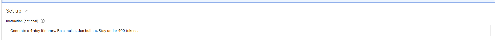
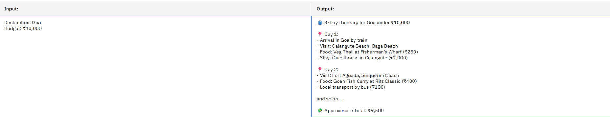

# 🌍 Travel Planner Agent

An AI-powered assistant that generates custom travel itineraries based on user inputs such as destination, number of days, and budget. Built using IBM Watsonx.ai's Prompt Lab with Granite Foundation Models under the IBM Cloud Lite plan — no coding required!

---

## ✨ Features

- 💬 Takes 3 user inputs: **Destination**, **Days**, and **Budget**
- 🧠 Uses **Granite-3-8b-instruct** model in **Prompt Lab**
- 📅 Outputs a full **3-day itinerary** including:
  - Places to visit
  - Budget hotel options
  - Local food suggestions
- 🛠️ Built using a **structured prompt template** (No-code)

---

## 🚀 Technologies Used

| Component        | Details                                |
|------------------|----------------------------------------|
| Platform         | IBM Cloud Lite                         |
| AI Tool          | IBM Watsonx.ai – Prompt Lab            |
| Model            | Granite-3-8b-instruct (Foundation Model)|
| Interface        | No-code (Prompt Lab Structured Mode)   |
| Deployment       | Prompt Lab Runtime (in Watsonx Studio) |

---

## 🖼️ Screenshots

| Prompt Lab Setup | Output Example |
|------------------|----------------|
|  |  |

---

## 📁 Project Files

- `TravelPlannerAgent_Presentation.pptx` – Project presentation
- `TravelPlannerAgent_Presentation.pdf` – Final submission PDF
- `screenshots/` – Contains Prompt Lab setup and results

---

## 📌 Problem Statement

Design a smart agent that can generate personalized travel itineraries using IBM Cloud Lite services and Watsonx.ai foundation models. Inputs include destination, number of travel days, and budget. The output must include day-wise plans, hotel, and food suggestions.

---

## ✅ Project Status

✔️ Completed and tested in IBM Watsonx Studio  
✔️ All inputs/outputs validated  
✔️ Submitted for SB4Academia Project (2025)

---

## 🔗 Useful Links

- 🔗 [IBM Watsonx Studio](https://dataplatform.cloud.ibm.com/)
- 🔗 [IBM Cloud](https://cloud.ibm.com)
- 🔗 [Granite Model Info](https://www.ibm.com/blog/granite-model-family)

---

## 👩‍💻 Developed By

**Priyanka Karale**  
Department of Data Science  
[DY PATIL AGRICULTURE AND TECHNICAL UNIVERSITY]

---

